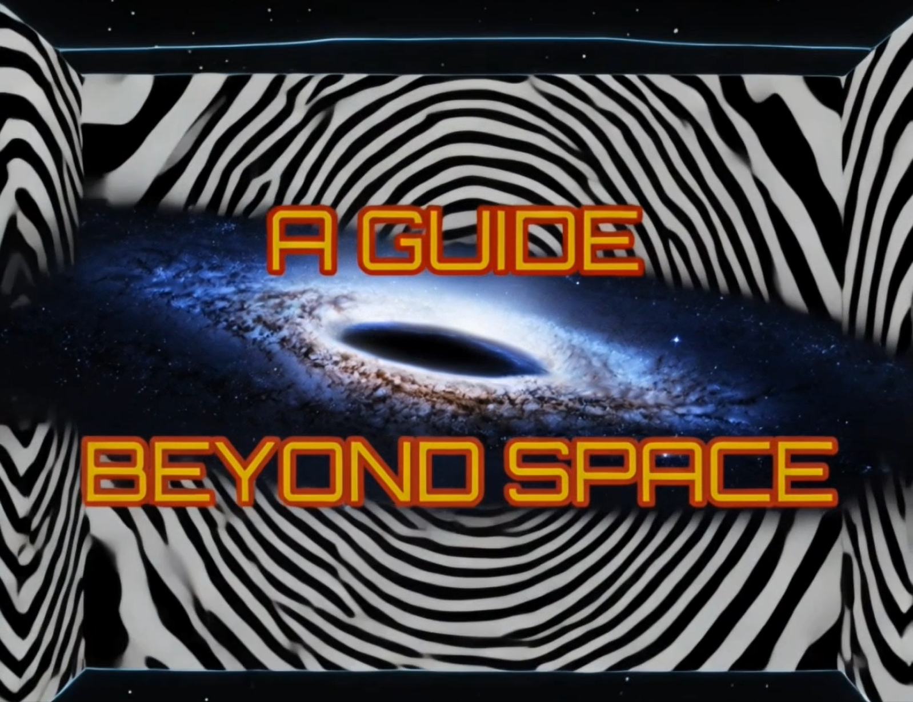

# A GUIDE BEYOND SPACE



**A Guide Beyond Space** is an XR museum experience that reimagines geometric abstraction through immersive spatial storytelling, interactive artwork extensions, and a conversational AI guide.

Guided by the astronaut **Dr. Alef Kepler**, visitors move through a futuristic exhibition space, encounter selected works from artists such as **Wassily Kandinsky, Bridget Riley, Victor Vasarely, Wojciech Fangor, Julian Stanczak, Margaret Wenstrup,** and **Edna Andrade**, and explore them through interactive spatial extensions.

## Overview

The project combines **XR storytelling, exhibition interaction, and a deployed conversational AI backend** to create a museum experience that goes beyond passive observation. Instead of only reading about abstract art, visitors are invited to move through a stylized virtual space, engage with artworks, trigger immersive visual responses, and ask questions to an AI-powered guide.

Developed in **Unity 6**, the experience includes:
- a futuristic virtual museum
- an interactive guide character
- guided and explorable exhibition stations
- immersive artwork visualizations
- a deployed RAG-based conversational AI system

## Tech Stack

**Frontend / XR**
- Unity 6
- C#
- XR Interaction Toolkit
- Meta Quest / Windows build

**3D / Content**
- Blender
- Mixamo
- Meshy

**AI / Backend**
- FastAPI
- Python
- ChromaDB
- Sentence Transformers
- OpenAI API
- ElevenLabs API
- Fly.io

## Conversational AI

The conversational mode allows visitors to ask spoken questions about artists, artworks, and exhibition context after the guided tour. The backend pipeline includes:
- speech-to-text
- retrieval from a curated knowledge base
- LLM-based answer generation
- text-to-speech response playback

The backend is deployed independently, so the application no longer depends on a private local network or development machine.

## Repository Structure

```text
AGuideBeyondSpace/
├── Assets/
├── Packages/
├── ProjectSettings/
├── beyond-space.png
└── README.md
```

## Project Focus

This project explores how XR can expand traditional museum mediation by translating geometric abstraction into an explorable spatial experience. The focus lies on:
- immersive interpretation of abstract artworks
- the interplay between guidance and exploration
- interactive character-driven storytelling
- AI-supported dialogue in exhibition spaces


## Author

Julia Nuss
AR/VR/XR Development & Design


